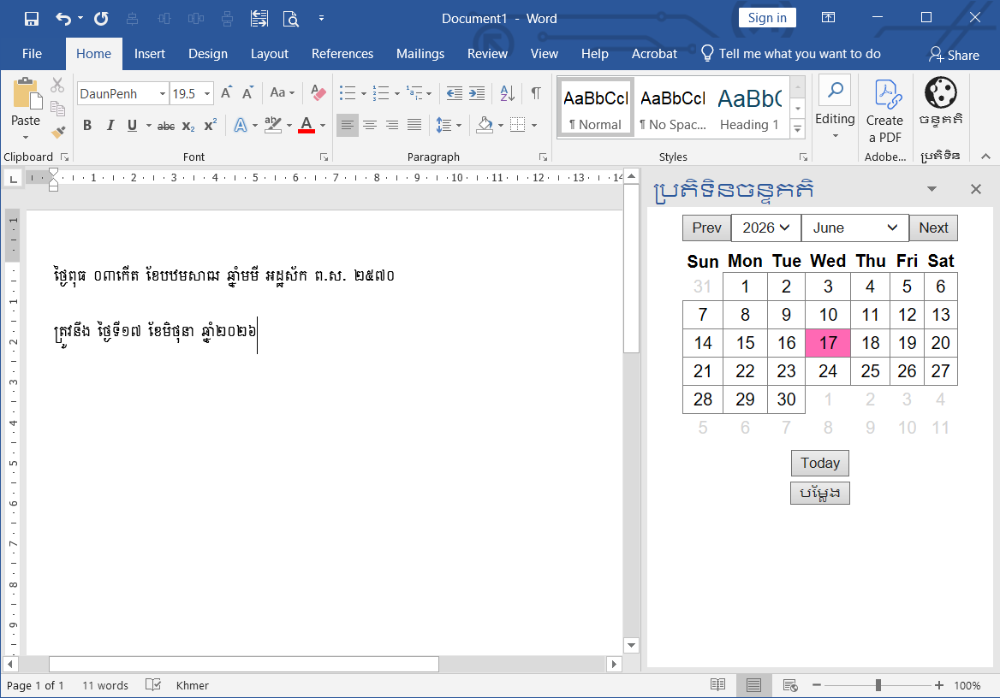

# WEPPLunarAddIn
WEPP Lunar AddIn កម្មវិធីជំនួយ (Add-In) សម្រាប់គណនា និងបំប្លែងថ្ងៃខែឆ្នាំចន្ទគតិជាភាសាខ្មែរក្នុងកម្មវិធី **Word**, **Excel** និង **PowerPoint** ។

## លក្ខណៈពិសេស (Features)
- បំប្លែងកាលបរិច្ឆេទដែលប្រើប្រាស់ជាសកល ឬសូរិយគតិ (Solar Calendar) ទៅកាលបរិច្ឆេទចន្ទគតិ (Khmer Lunar Calendar) តាមបែបដែលខ្មែរប្រើប្រាស់វិញ
- បង្ហាញលទ្ធផលត្រឹមត្រូវតាមទម្រង់ប្រពៃណីខ្មែរ (ឧទាហរណ៍៖ ថ្ងៃ... កើត/រោច ខែ... ឆ្នាំ...)
- ងាយស្រួលដំឡើង និងប្រើប្រាស់ផ្ទាល់ជាមួយកម្មវិធី **Word**, **Excel** និង **PowerPoint**
- អាចដំណើរការជាមួយ **Office 2013** ឬខ្ពស់ជាងនេះ (បានធ្វើការសាកល្បងដោយជោគជ័យ)
- ទាញយក និងប្រើប្រាស់ដោយ**ឥតគិតថ្លៃ** (**Free**)​

## របៀបតម្លើង (Installation)
- ទាញយកឯកសារចេញពីផ្នែក [Releases](Releases)
- ចុចបើកកម្មវិធីដែលបានទាញយក (ឧទាហរណ៍ WEPPLunarAddinSetup_1.0.5.msi)
- ចុច **Next**

- ជ្រើសរើស **Just me** សម្រាប់តែអ្នកប្រើប្រាស់តែម្នាក់ ឬ **Everyone** សម្រាប់អ្នកប្រើប្រាស់ទាំងអស់ក្នុងកុំព្យូទ័ររបស់អ្នក

- ចុច **Next**

- រងចាំដល់ការតម្លើងបានបញ្ចប់

- ចុច **Close** ជាការស្រេច

## របៀបប្រើប្រាស់ (Usage)
- ការកម្មវិធីណាមួយក្នុងចំណោមកម្មវិធី **Word**, **Excel** ឬ **PowerPoint**
- នៅក្នុង **Home Tab** មើលទៅ**ផ្នែកខាងស្ដាំ**នៃ **Ribbon** រកមើលក្រុម **ប្រតិទិន** 
- ចុចលើ **ចន្ទគតិ** ប្រតិទិននឹងលោតចេញនៅផ្នែកខាងស្ដាំនៃកម្មវិធី
- ជ្រើសរើសកាលបរិច្ឆេទដែលអ្នកចង់បាន
- ចុច **បម្លែង**

## អជ្ញាប័ណ License
គម្រោងនេះត្រូវបានផ្តល់អាជ្ញាប័ណ្ណក្រោមអាជ្ញាប័ណ្ណ MIT - សម្រាប់ព័ត៌មានលម្អិតសូមមើលឯកសារ [អាជ្ញាប័ណ្ណ](LICENSE) ។

This project is licensed under the MIT License - see the [LICENSE](LICENSE) file for details.
